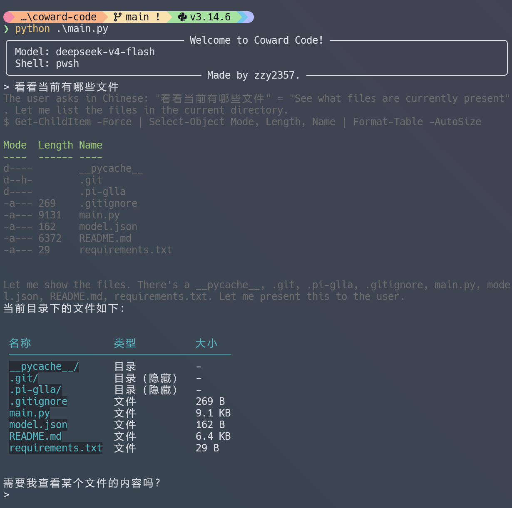

+++
date = '2026-08-15T12:14:25+08:00'
title = '手写一个简单的 Claude Code'
showToc = true
tags = ['ai', 'harness']

+++

本文将带你手把手写一个简单的 Claude Code，以了解 harness 的基本原理。

## `openai` 库

Chat Completions API 是由 OpenAI 提出的一套对话接口规范，很多模型厂商都选择兼容它（比如本文要用的 DeepSeek，接口格式和 OpenAI 几乎一模一样）。

在 Python 中，OpenAI 提供了一个叫 `openai` 的库，可以用来调用所有兼容该接口的模型，而不只是 OpenAI 自家的模型。

```bash
pip install openai
```

### 对话

#### 单轮对话

以下是 DeepSeek 官方接口文档的单轮对话示例：

```python
import os
from openai import OpenAI

client = OpenAI(
    api_key=os.environ.get('DEEPSEEK_API_KEY'),
    base_url="https://api.deepseek.com")

response = client.chat.completions.create(
    model="deepseek-v4-pro",
    messages=[
        {"role": "system", "content": "You are a helpful assistant"},
        {"role": "user", "content": "Hello"},
    ],
    stream=False, # 非流式输出，一次性输出完整的响应
    reasoning_effort="high",
    extra_body={"thinking": {"type": "enabled"}} # `thinking` 是 DeepSeek 官方额外提供的字段，原 API 并没有这一个设置
)

print(response.choices[0].message.reasoning_content)	# 思考内容
print(response.choices[0].message.content)				# 正文
```

#### 多轮对话

上面一个单轮对话的例子，也就是说，LLM 本身并不存储上下文，需要你来记录上下文，在每一轮对话前提供给 LLM：

```python
# 第一轮对话
messages.append({'role': 'user', 'content': '你好呀，我叫 Alice'})
response = client.chat.completions.create(
	...
    messages=messages
)
messages.append(response.choices[0].message) # assistant: 你好呀，Alice！很高兴认识你 😊

# 第二轮对话
messages.append({'role': 'user', 'content': '我叫什么名字？'})
response = client.chat.completions.create(
	...
    messages=messages
)
messages.append(response.choices[0].message) # assistant: 你叫 Alice 呀～😄 刚才你告诉我的，我记得呢！
```

每次都把聊天记录附给 LLM，这样 LLM 就有了上下文。

### 工具调用

LLM 可以调用工具，以下是我修改并精简过的 DeepSeek 官方接口文档的示例的片段，我分成多片：

#### 工具定义（提供给 LLM 看的）

```python
tools = [
    {
        "type": "function",
        "function": {
            "name": "get_date",
            "description": "Get the current date",
            "parameters": { "type": "object", "properties": {} },
        }
    },
    {
        "type": "function",
        "function": {
            "name": "get_weather",
            "description": "Get weather of a location, the user should supply the location and date.",
            "parameters": {
                "type": "object",
                "properties": {
                    "location": { "type": "string", "description": "The city name" },
                    "date": { "type": "string", "description": "The date in format YYYY-mm-dd" },
                },
                "required": ["location", "date"]
            },
        }
    },
]
```

#### 工具的实现（将工具和函数对应起来）

```python
def get_date_mock():
    return datetime.now().strftime("%Y-%m-%d")

def get_weather_mock(location, date):
    return "Cloudy 7~13°C"

TOOL_CALL_MAP = {
    "get_date": get_date_mock,
    "get_weather": get_weather_mock
}
```

#### 一轮内工具多次循环、一次内工具内部循环和多轮对话循环

```python
def run_turn():
    while True: # 注意！一轮对话可能会有多次工具调用，这里的循环是一轮对话内的工具调用的循环，不是对话循环
            response = client.chat.completions.create(
                ...
                tools=tools
            )
            messages.append(response.choices[0].message) # 添加到聊天记录
            ...
            tool_calls = response.choices[0].message.tool_calls
            # If there is no tool calls, then the model should get a final answer and we need to stop the loop
            if tool_calls is None:
                break
            for tool in tool_calls: # 一次内工具调用可能会调用多个工具
                tool_function = TOOL_CALL_MAP[tool.function.name]
                tool_result = tool_function(**json.loads(tool.function.arguments))
                print(f"tool result for {tool.function.name}: {tool_result}\n")
                messages.append({
                    "role": "tool",
                    "tool_call_id": tool.id,
                    "content": tool_result,
                })
# 此处才是对话循环
while True:
    messages.append({'role': 'user', 'content': input('> ')})
	run_turn()
...
```

注意，DeepSeek 官方文档指出：

> 请注意，携带了 `tools` 参数的请求，在后续所有请求中，必须完整回传 `reasoning_content` 给 API。若您的代码中未正确回传 `reasoning_content`，API 会返回 400 报错。

### 流式输出

前面聊的都是非流式：`stream=False`，模型想完了才一次性把完整回复吐出来。流式则是 `stream=True`，模型边生成边把内容一小段一小段推给你，Claude Code 里思考过程一个字一个字蹦出来的效果就是这么来的。

下面这段是 DeepSeek 官方文档的流式示例，我加了点注释：

```python
from openai import OpenAI
client = OpenAI(api_key="<DeepSeek API Key>", base_url="https://api.deepseek.com")

# Turn 1
messages = [{"role": "user", "content": "9.11 and 9.8, which is greater?"}]
response = client.chat.completions.create(
    model="deepseek-v4-pro",
    messages=messages,
    stream=True,  # 流式：模型边生成边推送，不是一次性返回
    reasoning_effort="high",
    extra_body={"thinking": {"type": "enabled"}},
)

reasoning_content = ""
content = ""

for chunk in response:
    # response 是可迭代对象，每个 chunk 只是一小段 delta，要自己拼起来
    # thinking 和 content 两个字段轮流出现，所以用 if/else 分拣：有 thinking 收 thinking，没有才收正文
    if chunk.choices[0].delta.reasoning_content:
        reasoning_content += chunk.choices[0].delta.reasoning_content
    else:
        content += chunk.choices[0].delta.content

# Turn 2
# The reasoning_content will be ignored by the API  ← 普通对话时 thinking 不参与后续生成
messages.append({"role": "assistant", "reasoning_content": reasoning_content, "content": content})
messages.append({'role': 'user', 'content': "How many Rs are there in the word 'strawberry'?"})
response = client.chat.completions.create(
    model="deepseek-v4-pro",
    messages=messages,
    stream=True,
    reasoning_effort="high",
    extra_body={"thinking": {"type": "enabled"}},
)
# ...
```

两个注意点：一是前面工具调用小节说过，请求一旦带了 `tools` 参数就必须完整回传 `reasoning_content`，否则 API 会 400，注释里"忽略"那条只适用于普通对话；二是 `chunk.choices[0].delta.reasoning_content` 直接访问可能报错，SDK 的 `ChoiceDelta` 没声明这个字段，稳妥写法是 `getattr(delta, 'reasoning_content', None)`，我们的实现里就是这么写的。

## `rich` 库

`rich` 是一个 Python 终端格式化库，用来给终端输出加颜色和排版。

```bash
pip install rich
```

代码里主要用到了四样东西。首先是 `Console`，`rich` 的打印入口，先 `console = Console()` 创建实例，之后统一用 `console.print(...)` 输出——内置 `print` 没有样式能力。

启动时的欢迎信息是用 `Panel` 包起来的，就是带边框的面板，`title` / `subtitle` 会显示在边框上。

模型返回的正文则用 `Markdown(content)` 包一层再打印，`rich` 会把 Markdown 渲染成带颜色的终端文本。

还有两个参数值得一提：`style='grey42'` 指定灰色，thinking 和工具输出都用灰色，跟正文区分开；`markup=False` 关掉样式标记解析——rich 默认会把字符串里的 `[xxx]` 当成颜色标签，thinking 或命令输出里一旦出现 `[` 就会被误解析甚至报错；`highlight=False` 则关掉自动语法高亮，让输出保持原样。

## 开始编写

### 读取配置

```python
config = {}

if os.path.exists('model.json'):
    with open('model.json', 'r') as f:
        config = json.load(f)
else:
    config['base_url'] = input('请输入 base url：')
    config['api_key'] = input('请输入 api key：')
    config['model'] = input('请输入模型：')
    config['shell'] = input('请选择 shell(bash/pwsh/powershell)[bash]：')
    if config['shell'].strip() == '':
        config['shell'] = 'bash'
    with open('model.json', 'w') as f:
        json.dump(config, f)
```

### 初始化

```python
messages = [{
    'role': 'system',
    'content': f'You are a useful assistant running in Coward Code. Your shell environment is { config["shell"] }.'
}]

client = OpenAI(api_key=config['api_key'], base_url=config['base_url'])

console.print(Panel(f'Model: { config["model"] }\nShell: { config["shell"] }', title='Welcome to Coward Code!', subtitle='Made by zzy2357.'))
```

### 工具调用

#### `read`

```python
{
        'type': 'function',
        'function': {
            'name': 'read',
            'description': 'Read a text file',
            'parameters': {
                'type': 'object',
                'properties': {
                    'path': {
                        'type': 'string',
                        'description': 'File path'
                    }
                },
                'required': ['path'],
            },
        },
}
```

```python
def read(path):
    try:
        with open(path, 'r', encoding='utf-8') as f:
            return f.read()
    except Exception as e:
        return f'Failed to read: { e }'
```

#### `write`

```python
{
        'type': 'function',
        'function': {
            'name': 'write',
            'description': 'Write a new text file',
            'parameters': {
                'type': 'object',
                'properties': {
                    'path': {
                        'type': 'string',
                        'description': 'File path'
                    },
                    'content': {
                        'type': 'string',
                        'description': 'Content'
                    },
                },
                'required': ['path', 'content'],
            },
        },
}
```

```python
def write(path, content):
    try:
        with open(path, 'w', encoding='utf-8') as f:
            f.write(content)
        return 'OK'
    except Exception as e:
        return f'Failed to write: { e }'
```

#### `bash`

```python
{
        'type': 'function',
        'function': {
            'name': 'bash',
            'description': 'Execute a bash command.',
            'parameters': {
                'type': 'object',
                'properties': {
                    'command': {
                        'type': 'string',
                        'description': 'Command'
                    }
                },
                'required': ['command'],
            },
        },
}
```

```python
def bash(command):
    try:
        result = subprocess.run(
            [config['shell'], '-c', command],  # 交给 shell 解析，支持 ls -la 这类带参数命令
            capture_output=True, # 捕获输出，而不是直接打印到屏幕上
            text=True, # 文本而不是字节
            encoding='utf-8',
            errors='replace' # 解码失败不抛异常（输出可能混 GBK/UTF-8）
        )
        output = result.stdout + result.stderr
        return output if output.strip() else '(no output)'
    except Exception as e:
        return f'Failed to execute: { e }'
```

#### `edit`

```python
{
        'type': 'function',
        'function': {
            'name': 'edit',
            'description': 'Edit multiple files',
            'parameters': {
                'type': 'object',
                'properties': {
                    'path': {
                        'type': 'string',
                        'description': 'Path to the file to edit'
                    },
                    'edits': {	# 可以编辑多处
                        'type': 'array',
                        'description': 'One or more targeted replacements',
                        'items': {
                            'type': 'object',
                            'properties': {
                                'old': {
                                    'type':
                                        'string',
                                    'description':
                                        'Exact text for one targeted replacement',
                                },
                                'new': {
                                    'type':
                                        'string',
                                    'description':
                                        'Replacement text for this targeted edit',
                                },
                            },
                            'required': ['old', 'new'],
                        },
                    },
                },
                'required': ['path', 'edits'],
            }
        },
}
```

```python
def edit(path, edits):
    try:
        content = read(path)
        for edit in edits:
            old = edit['old']
            new = edit['new']
            if old not in content:
                return f'"{ old }" not found in { path }'
            content = content.replace(old, new)

        write_result = write(path, content)
        if write_result != 'OK':
            return write_result
        return 'OK'
    except Exception as e:
        return f'Failed to edit: { e }'
```

#### 将工具和函数对应

```python
TOOL_CALL_MAP = {'read': read, 'write': write, 'bash': bash, 'edit': edit}
```

### 主循环

主循环分两层：外层是对话循环（跟前面 API 示例的结构一样），内层是工具调用循环——一轮对话里模型可能要调用多次工具，每执行一次都要把结果回传让它继续推理。下面把主循环拆成六段，按执行顺序来看。

#### 对话循环（外层）

```python
while True:
    user_input = input('> ')
    if user_input.startswith('/quit'):
        break
    messages.append({'role': 'user', 'content': user_input})
```

拿到输入后追加到 `messages`，然后进入内层的工具调用循环处理这一轮对话。后面五段在完整程序里都位于这一层 `while True:` 内部，这里为了单独看每一段，去掉了外层缩进。

#### 工具调用循环（内层）

```python
while True:
    response = client.chat.completions.create(
        model=config['model'],
        messages=messages,
        tools=tools,
        stream=True,
        reasoning_effort="high",
        extra_body={"thinking": {
            "type": "enabled"
        }},
    )
```

#### 流式累积 delta

```python
# 流式累积 delta：thinking 即时打印，content / tool_calls 拼完整再处理
reasoning_content = ""
content = ""
tool_calls = []  # 按 index 放到对应工具的位置（一个工具的内容会跨多个 chunk）
for chunk in response:
    if not chunk.choices:
        continue  # 末尾 usage 空块
    delta = chunk.choices[0].delta
    rc = getattr(delta, 'reasoning_content', None)  # DeepSeek 扩展字段，SDK 的 ChoiceDelta 未声明
    if rc:
        reasoning_content += rc
        console.print(rc, end='', style='grey42', highlight=False, markup=False)  # markup=False：rich 默认把 [xxx] 当样式标签，thinking 里的方括号会被误解析
    if delta.content:
        content += delta.content
    if delta.tool_calls:
        for tc in delta.tool_calls:
            # 把列表撑到对应长度
            while len(tool_calls) <= tc.index:
                tool_calls.append({'id': '', 'type': 'function', 'function': {'name': '', 'arguments': ''}})
            entry = tool_calls[tc.index]
            if tc.id:
                entry['id'] = tc.id
            if tc.function:
                if tc.function.name:
                    entry['function']['name'] = tc.function.name
                if tc.function.arguments:
                    entry['function']['arguments'] += tc.function.arguments
```

`stream=True` 时模型的响应被切成很多小 `chunk`，每个 `delta` 只带一段内容，要自己拼起来。三样东西分开处理：`thinking` 逐字即时打印，`content` 和 `tool_calls` 先拼完整再用。`tool_calls` 为什么要按 `index` 归位？看看流式响应长什么样就明白了——模型一次声明两个工具（`read` 和 `bash`）时，收到的 chunk 大致是这样（省略了无关字段）：

```json
// chunk 1：第一个工具开始
{"choices": [{"delta": {"tool_calls": [{"index": 0, "id": "call_1", "function": {"name": "read", "arguments": ""}}]}}]}

// chunk 2：arguments 被切碎，只有一小段
{"choices": [{"delta": {"tool_calls": [{"index": 0, "function": {"arguments": "{\"path\": \""}}]}}]}

// chunk 3：arguments 续上
{"choices": [{"delta": {"tool_calls": [{"index": 0, "function": {"arguments": "main.py\"}"}}]}}]}

// chunk 4：第二个工具开始，index 变成 1
{"choices": [{"delta": {"tool_calls": [{"index": 1, "id": "call_2", "function": {"name": "bash", "arguments": ""}}]}}]}

// chunk 5：第二个工具完成
{"choices": [{"delta": {"tool_calls": [{"index": 1, "function": {"arguments": "{\"command\": \"ls\"}"}}]}}]}
```

关键在 `index`：它是工具在本次回复里的序号（0、1、2...），同一个工具的 `name` / `arguments` 会被切在多个 chunk 里陆续推过来。如果不管 `index` 直接往后拼，两个工具的 `arguments` 就会糊在一起。所以代码里维护一个 `tool_calls` 列表，先按 `index` 把列表撑到对应长度，再把 `name` / `arguments` 用 `+=` 累积到对应位置——一个工具的内容全到齐后，`entry` 就是一个完整的工具调用了。

#### 打印输出

```python
if reasoning_content:
    console.print()  # 收尾 thinking 行
if content:
    console.print(Markdown(content))
```

`thinking` 是边收边打印的（第 3 段里），这里只在结束时补一个换行；正文则用 rich 的 `Markdown` 渲染一次。

#### 回传 assistant 消息

```python
assistant_msg = {'role': 'assistant', 'content': content or None}
if tool_calls:
    assistant_msg['tool_calls'] = tool_calls
    # 文档要求：带 tools 的请求必须回传 reasoning_content，否则 API 400
    assistant_msg['reasoning_content'] = reasoning_content
if content or tool_calls:
    messages.append(assistant_msg)  # 无工具调用时不回传 reasoning_content
```

把这一轮模型的回复存进 `messages`，两个细节：只有调用了工具才需要回传 `reasoning_content`（DeepSeek 的要求，否则 400）；如果 `content` 和 `tool_calls` 都为空（比如只有 thinking），就什么都不追加。

#### 执行工具调用

```python
if not tool_calls:
    break
for tool in tool_calls:
    fn = tool['function']
    args = json.loads(fn['arguments'])
    tool_function = TOOL_CALL_MAP[fn['name']]
    tool_result = tool_function(**args)
    body = tool_result
    if len(body) > 2000:
        body = body[:2000] + '\n...'
    header = f"$ { args['command'] }" if fn['name'] == 'bash' else fn['name']
    console.print(f"{header}\n{body}", style='grey42', highlight=False, markup=False)  # 命令输出也可能带 [，同样关掉
    messages.append({
        "role": "tool",
        "tool_call_id": tool['id'],
        "content": tool_result,
    })
```

没有工具调用说明模型已经给出最终回答，`break` 跳出内层循环，回到外层等待下一条输入。有工具调用就逐个执行：从 `TOOL_CALL_MAP` 找到对应函数、解析参数并调用，然后把结果以 `role: tool` 追加回 `messages`——回到第 2 段的内层 `while` 顶部再问一次模型，直到它不再调用工具。

把上面六段按顺序拼起来，就是完整的主循环。

## 完整代码

```python
from openai import OpenAI
import os
import json
import subprocess
from rich.console import Console
from rich.markdown import Markdown
from rich.panel import Panel

console = Console()

# 配置
config = {}

if os.path.exists('model.json'):
    with open('model.json', 'r') as f:
        config = json.load(f)
else:
    config['base_url'] = input('请输入 base url：')
    config['api_key'] = input('请输入 api key：')
    config['model'] = input('请输入模型：')
    config['shell'] = input('请选择 shell(bash/pwsh/powershell)[bash]：')
    if config['shell'].strip() == '':
        config['shell'] = 'bash'
    with open('model.json', 'w') as f:
        json.dump(config, f)

tools = [
    {
        'type': 'function',
        'function': {
            'name': 'read',
            'description': 'Read a text file',
            'parameters': {
                'type': 'object',
                'properties': {
                    'path': {
                        'type': 'string',
                        'description': 'File path'
                    }
                },
                'required': ['path'],
            },
        },
    },
    {
        'type': 'function',
        'function': {
            'name': 'write',
            'description': 'Write a new text file',
            'parameters': {
                'type': 'object',
                'properties': {
                    'path': {
                        'type': 'string',
                        'description': 'File path'
                    },
                    'content': {
                        'type': 'string',
                        'description': 'Content'
                    },
                },
                'required': ['path', 'content'],
            },
        },
    },
    {
        'type': 'function',
        'function': {
            'name': 'bash',
            'description': 'Execute a bash command.',
            'parameters': {
                'type': 'object',
                'properties': {
                    'command': {
                        'type': 'string',
                        'description': 'Command'
                    }
                },
                'required': ['command'],
            },
        },
    },
    {
        'type': 'function',
        'function': {
            'name': 'edit',
            'description': 'Edit multiple files',
            'parameters': {
                'type': 'object',
                'properties': {
                    'path': {
                        'type': 'string',
                        'description': 'Path to the file to edit'
                    },
                    'edits': {
                        'type': 'array',
                        'description': 'One or more targeted replacements',
                        'items': {
                            'type': 'object',
                            'properties': {
                                'old': {
                                    'type':
                                        'string',
                                    'description':
                                        'Exact text for one targeted replacement',
                                },
                                'new': {
                                    'type':
                                        'string',
                                    'description':
                                        'Replacement text for this targeted edit',
                                },
                            },
                            'required': ['old', 'new'],
                        },
                    },
                },
                'required': ['path', 'edits'],
            }
        },
    },
]


def read(path):
    try:
        with open(path, 'r', encoding='utf-8') as f:
            return f.read()
    except Exception as e:
        return f'Failed to read: { e }'


def write(path, content):
    try:
        with open(path, 'w', encoding='utf-8') as f:
            f.write(content)
        return 'OK'
    except Exception as e:
        return f'Failed to write: { e }'


def bash(command):
    try:
        result = subprocess.run(
            [config['shell'], '-c', command],  # 交给 shell 解析，支持 ls -la 这类带参数命令
            capture_output=True, # 捕获输出，而不是直接打印到屏幕上
            text=True, # 文本而不是字节
            encoding='utf-8',
            errors='replace' # 解码失败不抛异常（输出可能混 GBK/UTF-8）
        )
        output = result.stdout + result.stderr
        return output if output.strip() else '(no output)'
    except Exception as e:
        return f'Failed to execute: { e }'


def edit(path, edits):
    try:
        content = read(path)
        for edit in edits:
            old = edit['old']
            new = edit['new']
            if old not in content:
                return f'"{ old }" not found in { path }'
            content = content.replace(old, new)

        write_result = write(path, content)
        if write_result != 'OK':
            return write_result
        return 'OK'
    except Exception as e:
        return f'Failed to edit: { e }'


TOOL_CALL_MAP = {'read': read, 'write': write, 'bash': bash, 'edit': edit}

messages = [{
    'role': 'system',
    'content': f'You are a useful assistant running in Coward Code. Your shell environment is { config["shell"] }.'
}]

client = OpenAI(api_key=config['api_key'], base_url=config['base_url'])

console.print(Panel(f'Model: { config["model"] }\nShell: { config["shell"] }', title='Welcome to Coward Code!', subtitle='Made by zzy2357.'))

while True:
    user_input = input('> ')
    if user_input.startswith('/quit'):
        break
    messages.append({'role': 'user', 'content': user_input})

    # 循环处理工具调用
    while True:
        response = client.chat.completions.create(
            model=config['model'],
            messages=messages,
            tools=tools,
            stream=True,
            reasoning_effort="high",
            extra_body={"thinking": {
                "type": "enabled"
            }},
        )

        # 流式累积 delta：thinking 即时打印，content / tool_calls 拼完整再处理
        reasoning_content = ""
        content = ""
        tool_calls = []  # 按 index 放到对应工具的位置（一个工具的内容会跨多个 chunk）
        for chunk in response:
            if not chunk.choices:
                continue  # 末尾 usage 空块
            delta = chunk.choices[0].delta
            rc = getattr(delta, 'reasoning_content', None)  # DeepSeek 扩展字段，SDK 的 ChoiceDelta 未声明
            if rc:
                reasoning_content += rc
                console.print(rc, end='', style='grey42', highlight=False, markup=False)  # markup=False：rich 默认把 [xxx] 当样式标签，thinking 里的方括号会被误解析
            if delta.content:
                content += delta.content
            if delta.tool_calls:
                for tc in delta.tool_calls:
                    while len(tool_calls) <= tc.index:
                        tool_calls.append({'id': '', 'type': 'function', 'function': {'name': '', 'arguments': ''}})
                    entry = tool_calls[tc.index]
                    if tc.id:
                        entry['id'] = tc.id
                    if tc.function:
                        if tc.function.name:
                            entry['function']['name'] = tc.function.name
                        if tc.function.arguments:
                            entry['function']['arguments'] += tc.function.arguments

        if reasoning_content:
            console.print()  # 收尾 thinking 行
        if content:
            console.print(Markdown(content))

        assistant_msg = {'role': 'assistant', 'content': content or None}
        if tool_calls:
            assistant_msg['tool_calls'] = tool_calls
            # 文档要求：带 tools 的请求必须回传 reasoning_content，否则 API 400
            assistant_msg['reasoning_content'] = reasoning_content
        if content or tool_calls:
            messages.append(assistant_msg)  # 无工具调用时不回传 reasoning_content

        if not tool_calls:
            break
        for tool in tool_calls:
            fn = tool['function']
            args = json.loads(fn['arguments'])
            tool_function = TOOL_CALL_MAP[fn['name']]
            tool_result = tool_function(**args)
            body = tool_result
            if len(body) > 2000:
                body = body[:2000] + '\n...'
            header = f"$ { args['command'] }" if fn['name'] == 'bash' else fn['name']
            console.print(f"{header}\n{body}", style='grey42', highlight=False, markup=False)  # 命令输出也可能带 [，同样关掉
            messages.append({
                "role": "tool",
                "tool_call_id": tool['id'],
                "content": tool_result,
            })

```

## 最终效果


